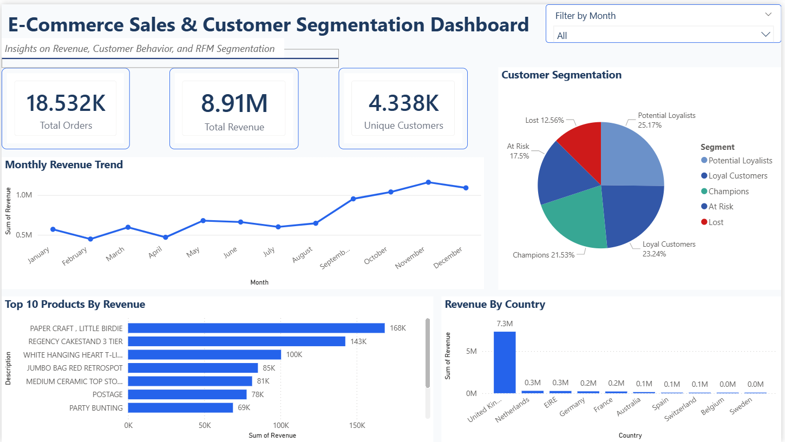

# E-Commerce Sales & Customer Segmentation Dashboard

This project focuses on analyzing e-commerce transaction data to understand revenue trends, customer purchasing behavior, and segmentation using RFM (Recency, Frequency, Monetary) analysis.  
The goal is to convert raw transactional data into meaningful business insights using SQL, Python, and Power BI.

## Dashboard Preview

[](dashboard/ecommerce_dashboard.pbix)

## Problem Statement

- Identify revenue trends over time  
- Analyze top-performing products and countries  
- Segment customers based on purchasing behavior  
- Help businesses understand high-value and at-risk customers

## Key Metrics

- Total Revenue£: 8,911,407.90
- Total Orders: 18,532
- Unique Customers: 4,338
- Unique Products: 3,665
- Countries: 37
- Date Range: Dec 2010 – Dec 2011

## Tech Stack

- Python (pandas, matplotlib, seaborn)
- SQL
- Power BI

## Project Structure

- 'data/' -> Dataset used for analysis
- 'notebooks/' -> Data cleaning & statistical analysis
- 'dashboard/' -> Power BI dashboard
- 'sql/' -> RFM Queries

## Architecture

- Data Collection -> Data Cleaning & Preprocessing -> Statistical Analysis -> RFM Analysis -> Power BI dashboard

## Key Insights

- The top 10 products by revenue accounted for approximately 18% of total sales
-	Monthly revenue peaked in November, likely driven by holiday season purchasing, while February registered the lowest sales volume.
-	The United Kingdom was the dominant market, contributing over 82% of total revenue, followed by the Netherlands, EIRE, Germany, and France
-	Customer RFM analysis revealed that a small segment of high-frequency, high-value customers represented the majority of revenue
- The busiest purchase times were between 10 AM and 3 PM on weekdays

## How to Run

1. Clone the repository
2. Install dependencies
```
pip install -r requirements.txt
```
3. Run Jupyter Notebook
```
jupyter notebook notebooks/ecommerce_analysis.ipynb
```
4. Open the Power BI dashboard from `dashboard/ecommerce_dashboard.pbix`

## Future Improvements

- Build an ML model to predict next month's revenue
- Build a classification model to predict which customers will churn using RFM scores
- Add interactive filters and drill-through pages

## Author

Akshat Jain
Aspiring Data Analyst | Python | SQL | Power BI | Data Visualization
LinkedIn: https://www.linkedin.com/in/akshat-jain-934098250
